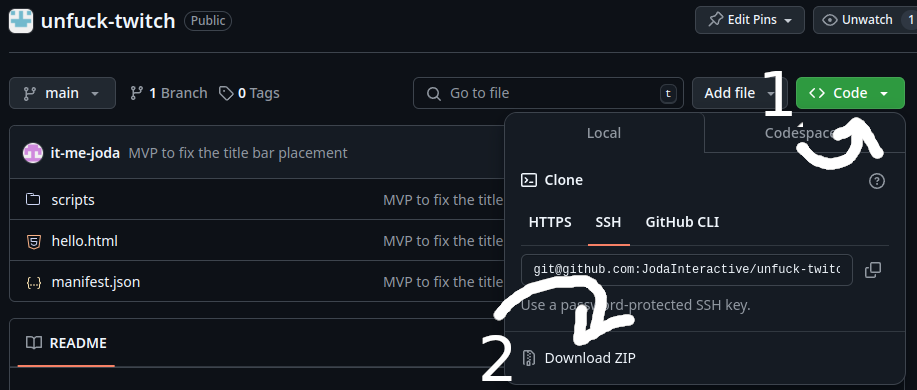

# How to Install

    1. Download ZIP 

    2. Unzip the ZIP
    - On Windows, right-click and extract
    - On Linux, use `unzip unfuck-twitch.zip`
    - On Mac, figure it out yourself

 

    3. Install in Chromium-based browser
        a. Navigate to `chrome://extensions`, `brave://extensions` etc.
        b. Enable Developer mode
        c. Load Unpacked (choose unzipped directory from step 2)

 

    4. Navigate to a Twitch stream and enjoy the Unfucked UI